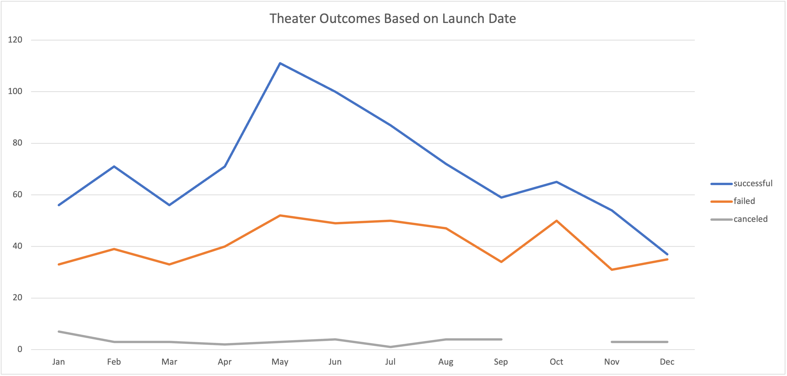

# Kickstarting with Excel

 

Tyrone Fraley 
UC Berkley Extension 
August 31, 2022 

 

  

 

## Overview of the Project

In this project a theater producer by the name of Louise wanted to have data (called >Kickstarter) on her theater plays, spaces, and musicals analyzed. The >Kickstarter data encompasses expansive data from her campaigns including, but not limited to: years, pledged amounts, goal amounts, names of theater acts, and outcomes of theater acts. She asked for her *Kickstarter* data to be analyzed, because Louise is getting ready to launch a new play called *Fever* with a starting budget of $10,000. Albeit, Louise's hesitance about the starting budget for her campaign. Her mission was to discover which campaigns were overall successful. This data was analyzed and after the discovery phase of her request ended. She asked for a new analysis to be conducted on the >Kickstarter data. The goal of the new analysis was to find out how successful her campaigns were when taking launch date and funding goals into account. The full data, analysis, and findings are within this document. 

### Purpose
 
The objective behind this analysis is to discover the relationship between Louise's campaigns' launch dates and funding goal. The objective in this analysis is to provide proper advice based on evidence in the empircal >Kickstarter data to highlight key findings of success and failures within Louise's campaigns. Such findings could assist Louise with strategically funding and executing future campaigns.
 
## Analysis and Challenges
 
To begin analyzing the >Kickstarter data properly. The initial data was expanded by adding new columns to assist in the dissimination and analysis of the results. These columns were labeled as >Percentage Donation, >Average Donation, >Parent Category, >Subcategory, >Date Created Conversion, > Date Ended Conversion, and >Years. This was to bolster the upcomming pivot tables which are located in newly created tabs labeled as >Outcomes based on Launch Date and >Outcomes Based on Goals.Both charts provide valuable information to assist Louise with her decision. 
 
### Outcomes Based on Launch Date
 

The first detailed chart created for research purposes on the >Kickstarter data is the >Outcomes Based on Launch Date chart. The purpose of the >Outcomes Based on Launch Date chart was to analyze the theater plays, musicals, and spaces relationship between outcomes and launch month. To do this a pivot table based on the >Kickstarter data was created with >Parent Category and >Years were applied filters in the pivot table. From here >Count of Outcomes was observed in the columns section, >Date Created Conversion was placed in the rows section, and >Count of outcomes was inservted in the Values section. From here it was important to now focus on >theater as the only selected variable within the >Parent Category section and >Years was set to all. This allowed the table to display months the theater plays took place, cancelations, failed events, live events, successful events, and a grand total of all events. Finally, a line chart was created as a visual resource to better understand the relationship between the months, years and the successful, failed, and canceled campaigns. 

### Outcomes Based on Goals
 

The second detailed chart created for further analyzation of the >Kickstarter data is the Outcomes Based on Goals chart. The purpose of the >Outcomes Based on Goals chart was to analyze the numbers of successful, failed, canceled  campaigns and their percentages. In this chart the following functions were applied:

        Column B:  
            *=COUNTIFS(Kickstarter!$D:$D,"<1000",Kickstarter!$F:$F,"successful",Kickstarter!$R:$R,"plays")
        Column C:
            *=COUNTIFS(Kickstarter!$D:$D,"<1000",Kickstarter!$F:$F,"failed",Kickstarter!$R:$R,"plays")
        Columb D: 
            *=COUNTIFS(Kickstarter!$D:$D,"<1000",Kickstarter!$F:$F,"canceled",Kickstarter!$R:$R,"plays")
        Column E:
            *=SUM(B3:D3)
        Column F:
            *=B2/E2
        Column G:
            *=C3/E3
        Column H:
            *=D2/E2
    
    The functiones utilized in each cell were a necessary strategy to analyze the gathered >Kickstarter data for further analysis reasons discussed later in this paper. Once all formulas were built within each cell within the >Outcomes Based on Goals table to further understand the relationship between the several types of theater campaigns and how successful they were. In addition, a line chart was created to futher visualize the connections amongst the goal-amount ranges and the perecentage of successful, canceled, and failed projects. Goal-amount exists on the x-axis on the x-axis and percentage of successful, canceled, and failed projects exists on the y-axis. From here the data was then captured within a line graph to display the percentage successful, failed, and canceled categories over a period of time.      
 

 

  

 

### Analysis of Outcomes Based on Launch Date

Discoveries were found wihtin the analysis of the >Outcomes Based on Launch Date. One could surmise that based on the assimilated data that the successful campaigns were 60% of the total 1,393 campaigns (=E18/F18). Whereas the failed campaigns were 35% of the total campaigns (=C18/F18). Canceled campaigns came in at 3% of the total campaigns (=B18/F18). It should me noted that in the middle  the years of (May - Aug, 2009 - 2017) Louise had the most success and the most failures. Between May and June alone there was a 56.33% increase in total successful campaigns ((=E10-E9)/E9*100). Based on the visual data within the line graph titled >Outcomes Based on Chart Date one could surmise that campaigns peaked amongst successful and failed campaigns in the middle of the year. These results diminished the most during the winter months. Goal-amounts were ranged on the x-axis whereas percentage of successful, failed, and canceled projects existed on the y-axis.
 

 

  

 

### Analysis of Outcomes Based on Goals

The >Outcomes Based on Goals helped deeper the understanding of Louise' campaigns within only her plays and what she could focus her campaigns on in the future. This will be detailed later in the >Results section of this paper. For now, the focus will be on the analysis of the >Outcomes Based on Goals Chart. In this section of the analysis the focus as detailed earlier was on the number of successful, failed, and canceled projects. The counts were then added to a >Total Projects (=SUM(b2:d2)) column and then percentages were populated in the >Percentage Successful, Failed, and Canceled columns ((=B2/C2), (=C2/E2), (=D2/E2)). 

### Challenges and Difficulties Encountered

  There were several challenges during the data collection and dissimination phases. Primarily this existed within deciding which rows to add and why they gained or presented significant importance. For instance, seperating categories into two new rows labeled as >Parent Category and >Sub Category was not clear at first until it was discovered within the study that the variable >Theater did not seperate itself from >plays, >musicals, >and spaces. Once this was recognized within the study it was discovered that they should be separated to make the analysis and vizualization process not only efficient, but easily understood within the date. If not, the several types of theater campaigns would have been amalgamated into the same data and one would not be able to tell which type of theater performance was the most successful.   

## Results

The theater projects that Louise conducted in the past had very interesting results within the Kickstarter data. It could be noted that the >Outcomes Based on Launch Date yeiled several findings. Shared with the >Outcomes Based on Goals chart one could tell that the most failures and successes happened within the months of May through Aug. However, it should be noted that in October there was an increase in successful and failed projects. In addition, canceled projects remained relatively low throughout the year. The month with the highest amount of cancelations was in January with 7 cancelations. The yearly data had an average of 3 cancelations per month (=AVERAGE(B6:B17)). Finally, the total failed projects came in at 493 and the total successful projects came in at 839. Failed campaigns on average were at an average of $879 pledged. Successful campaigns had an average of $6,097.24 pledged. Canceled campaigns had an average of $2,658.35 pledged. 
 

 

  

 

After analyzing the >Outcomes Based on Goals data findings spotlighted on the percentages of successful, failed, and canceled campaigns. The data is similar to that of the >Outcomes based on Launch Date data. Considering that there were more successful campaigns than failed, and canceled campaigns. However, as the goal started increasing the number of successful and failed campaigns began to diminish. For example, when projects ranged between 45,000 to 49,999 there were no successes, only one failure and no cancelations. Albeit when the projects reached 50,000 or more thre were two successes and 14 failures (no cancelations). The question must be begged that maybe the goal coast is best met when it is less than or equal to 19,999, because the most successful projects were at or below 19,999 as a goal. 

### What are some limitations of this dataset?
The data set did not observe run times for plays and costs per ticket. The run times for the plays could have been a valuable resource to understand the qualitative side of the data. Considering that some viewers may not want to attend a long or short theatrical event. Costs per ticket and run time could be a factor in cancelations or the overall success rate of the individual projects. Considering that consumers may not want to attend an event depending on what time of year the event is available to them, how long or short the event will be, and if the cost per ticket constitutes itself based on the two previously mentioned factors. This would allow a deep dive into the consumer behavior aspect of this study. 

- What are some other possible tables and/or graphs that we could create?

Based on this information, Louise could move forward with her play. Considering there could be a correlation between cost of pledge and the play. Which would mean her $10,000 investment could be rewarding in the end. However, it should be noted that further research should be done on what types of plays do the best. This may help Louise discover genres within theater plays that could yeild high returns throughout the year and globally. 

